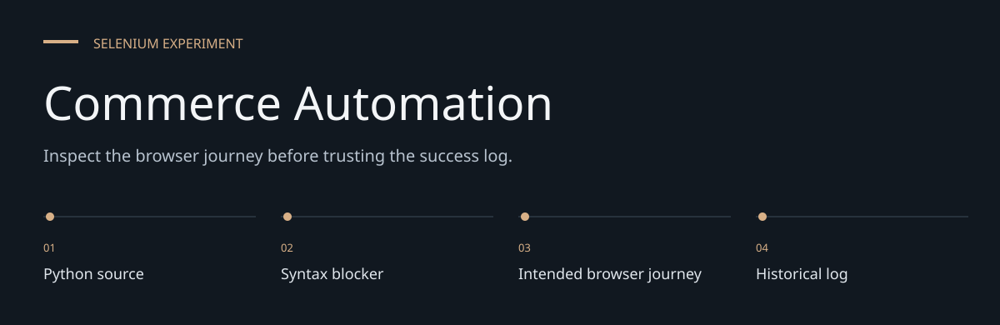
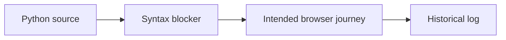

# Commerce Automation

**Inspect the browser journey before trusting the success log.**

A Selenium script exploring a live e-commerce journey on Nike India: navigation, product
selection, cart interactions and login-related flows.


[Architecture](docs/ARCHITECTURE.md) · [Evaluation guide](docs/EVALUATION.md)

**Contents:** [The challenge](#the-challenge) · [Walkthrough](#walk-through-the-project) ·
[Implementation](#implementation-state) · [Design choices](#engineering-choices) ·
[Next evidence](#next-evidence-to-collect)

---

## The challenge

Browser scripts can log success despite earlier failures when exceptions are only printed or
logged. This Nike-site experiment demonstrates why syntax, explicit assertions and a controlled
environment must precede any pass-rate or quality claim.

## System at a glance



## Walk through the project

### 1. Inspect the source

The committed login call contains invalid literal placeholders. Python parsing stops before any
browser journey can execute.

### 2. Review intended actions

The script contains navigation, product/cart and login interactions on a live external site. Those
actions must be moved to or authorized for an appropriate test environment.

### 3. Read failure handling

Several handlers catch broad errors and log them; the final success message can still appear. A
message is not a test assertion.

### 4. Define meaningful acceptance

Once launch blockers are fixed, expected outcomes need explicit checks and controlled data. The
saved log is historical evidence, not a current passing suite.

## Current state

[Automation_code.py](Automation_code.py) contains the browser automation.
It is not executable as committed: the login call contains literal `<Enter username>` and
`<Enter Password>` placeholders, which are invalid Python syntax.

[test_execution.log](test_execution.log) is a saved execution log. It does not prove that the
current committed script passes, and several handlers log failures without propagating them.
The final success message can therefore appear after an earlier operation failed.

## Dependencies

The script imports Selenium, Requests and webdriver-manager and expects Chrome.
There is no requirements file or dependency lockfile.

```bash
git clone https://github.com/DanushArun/E-commerce-website-automated-quality-testing.git
cd E-commerce-website-automated-quality-testing
python3 -m venv .venv
source .venv/bin/activate
python -m pip install selenium requests webdriver-manager
python -m py_compile Automation_code.py
```

The final command currently reports a syntax error at the placeholder login call.
Resolve that source error before attempting a browser run. The script does not load the
`credentials.json` file described by earlier documentation.

## Execution boundary

This script targets an external production website and performs cart and login interactions.
Run only with an authorized test account and an appropriate testing environment.
Selectors, redirects and anti-automation behavior can change independently of this repository.

## Verification

The source and saved log were reviewed. Syntax validation identified the committed blocker.
No live browser journey was executed for this documentation update.
There is no isolated test fixture, automated assertion suite or verified pass rate.

## Engineering choices

**Source filename is authoritative.** Automation_code.py is the actual script; the previous README
named a nonexistent file.

**No silent pass claim.** Logged failures and a final success string are not a passing test result.

**Live actions need a test boundary.** Documentation review does not perform cart/login actions on
an external production service.

## Implementation state

| State | Current evidence |
| --- | --- |
| Present | Browser journey and saved log |
| Blocked | Invalid login placeholder syntax |
| Not present | Locked dependencies or isolated fixture/assertion suite |
| Not verified | Current live-site behavior or a reliable pass rate |

The [architecture guide](docs/ARCHITECTURE.md) maps these statements to source entry points.
The [evaluation guide](docs/EVALUATION.md) separates inspection, executable checks and
domain validation, with the next evidence needed for each project.

## Next evidence to collect

- Fix syntax and credential configuration in a separate implementation change.
- Use a controlled test site and explicit assertions.
- Record failure propagation and expected browser outcomes.
