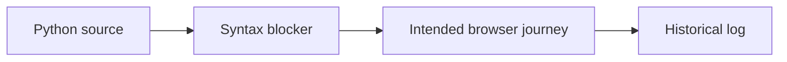

# Commerce Automation — Architecture and implementation

This guide follows the tracked implementation. Proposed work is identified separately.

## The problem and the system boundary

Browser scripts can log success despite earlier failures when exceptions are only printed or
logged. This Nike-site experiment demonstrates why syntax, explicit assertions and a controlled
environment must precede any pass-rate or quality claim.

## Processing path

## End-to-end behavior

### 1. Inspect the source

The committed login call contains invalid literal placeholders. Python parsing stops before any
browser journey can execute.

### 2. Review intended actions

The script contains navigation, product/cart and login interactions on a live external site. Those
actions must be moved to or authorized for an appropriate test environment.

### 3. Read failure handling

Several handlers catch broad errors and log them; the final success message can still appear. A
message is not a test assertion.

### 4. Define meaningful acceptance

Once launch blockers are fixed, expected outcomes need explicit checks and controlled data. The
saved log is historical evidence, not a current passing suite.

## Design choices and consequences

### Source filename is authoritative

Automation_code.py is the actual script; the previous README named a nonexistent file.

### No silent pass claim

Logged failures and a final success string are not a passing test result.

### Live actions need a test boundary

Documentation review does not perform cart/login actions on an external production service.

## Source entry points

### [Automation_code.py](../Automation_code.py)

Committed source fails syntax parsing; see the README launch blocker.

### [test_execution.log](../test_execution.log)

This file is part of the reviewed path described above. Follow its imports and calls
for the exact interface rather than inferring behavior from the filename.

## Implementation state

| State | Evidence boundary |
| --- | --- |
| Present | Browser journey and saved log |
| Blocked | Invalid login placeholder syntax |
| Not present | Locked dependencies or isolated fixture/assertion suite |
| Not verified | Current live-site behavior or a reliable pass rate |

“Present” means tracked source or assets exist. It does not mean a production or domain
validation has passed. See [Evaluation](EVALUATION.md) for reproducible checks and limits.
